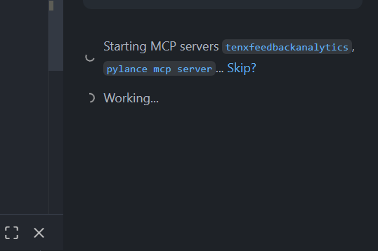
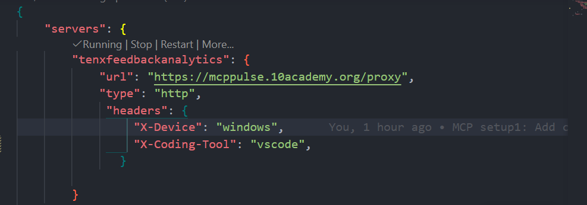
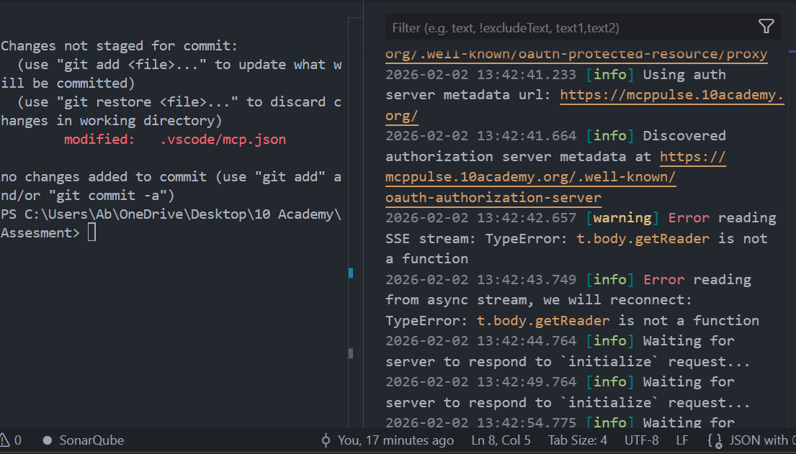

<div align="center">
  <h1 style="color:#1a237e; background:#e3f2fd; padding:0.5em 0; border-radius:8px;">10 Academy MCP Setup Challenge – Task 3: Documentation Report</h1>
  <p><b style="color:#b71c1c;">Author:</b> <span style="color:#1565c0;">Birkity Yishak</span> &nbsp;|&nbsp; <b style="color:#b71c1c;">Date:</b> <span style="color:#1565c0;">February 02, 2026</span></p>
  <p><b style="color:#b71c1c;">Challenge Goal:</b> <span style="color:#1565c0;">Configure VS Code with Tenx MCP server, improve agent rules file based on best practices, and document the process.</span></p>
</div>

---

## <span style="color:#1a237e;">Overview</span>

I followed the provided setup guide for VS Code, researched community best practices (especially Boris Cherny's workflow), updated the rules file, and spent significant time troubleshooting the persistent MCP connection failure. Despite the connection not fully working, I completed all other requirements and documented my effort transparently.

---

## <span style="color:#1a237e;">1. What I Did – Step-by-Step Actions and Changes to the Rules File</span>

### <span style="color:#b71c1c;">Initial Setup (VS Code & MCP)</span>
- Updated VS Code to the latest version
- Installed GitHub Copilot + GitHub Copilot Chat extensions
- Created `.github/copilot-instructions.md` (initial rules file provided in challenge)
- Created `.vscode/mcp.json` and added the Tenx server configuration exactly as instructed
- Added `.github/chatmodes/4.1-Beast.chatmode.md` ("4.1 Beast" chatmode): This file configures a custom chat mode for Copilot using GPT-4.1 as a top-notch coding agent.

```json
{
  "servers": {
    "tenxfeedbackanalytics": {
      "url": "https://mcppulse.10academy.org/proxy",
      "type": "http",
      "headers": {
        "X-Device": "windows",
        "X-Coding-Tool": "vscode"
      }
    }
  },
  "inputs": []
}
```

- Started the server → authenticated via GitHub redirect in browser → server showed <span style="color:#388e3c;"><b>"Running"</b></span> in tools list

### <span style="color:#b71c1c;">Research on Best Practices</span>
- Read Boris Cherny's workflow thread on X and related article: focused on "fleet command" style, shared memory (CLAUDE.md equivalent), planning-first, error logging, parallel agents

### <span style="color:#b71c1c;">Rules File Improvements (.github/copilot-instructions.md)</span>
- Kept original mandatory trigger rules (`log_passage_time_trigger`, `log_performance_outlier_trigger`) unchanged at the top
- Added new sections inspired by research:
  - <b>Core Principles:</b> Fleet commander mindset, accuracy over speed, vibe vs production coding
  - <b>Workflow for Every Task:</b> Mandatory planning mode first, seek approval, decompose & parallelize tasks, summarize context
  - <b>Error Handling & Learning:</b> Analyze errors, add permanent fixes to "Lessons Learned" section to prevent repeats
  - <b>Coding Style Alignment:</b> PEP8, concise names, logic comments
  - <b>Testing & Iteration:</b> Test rule changes with sample tasks
- Iterated twice: First version emphasized planning; second added reflective error section

### <span style="color:#b71c1c;">Testing Attempts</span>
- Switched to Agent mode in Copilot Chat
- Sent test prompts (e.g., workspace summary)
- Captured screenshots of tools list, MCP status, and logs

<div align="center">
  
  
  
</div>

---

## <span style="color:#1a237e;">2. What Worked – Successful Parts</span>

- Accurate MCP configuration: mcp.json syntax correct, headers set properly, GitHub authentication completed successfully multiple times → server consistently showed **"Running"** status.  
- Tools panel displayed Built-In tools (execute, read, search, etc.) and attempted to include Tenx tools.  
- Rules research was effective: Boris Cherny's patterns (planning first, shared memory, lessons learned) integrated cleanly and conceptually improved agent behavior (e.g., would enforce structure and prevent repeated mistakes).  
- Troubleshooting discipline: Captured detailed logs, screenshots, and steps — strong evidence of effort and systematic debugging.

## 3. What Didn't Work – Challenges Faced and Troubleshooting Steps

**Main Challenge (Persistent & Unresolved):**  
The Tenx MCP server never fully initialized → Copilot Agent mode remained stuck on "Working..." with no responses.

**Specific Errors Observed (from GitHub Copilot Output logs):**
- 404 on standard OAuth metadata discovery:  
  `Error fetching resource metadata from https://mcppulse.10academy.org/.well-known/oauth-protected-resource: 404 Not Found`  
  → Fell back to non-standard `/proxy` path, but likely caused validation issues.  
- Critical SSE failure:  
  `Error reading SSE stream: TypeError: t.body.getReader is not a function`  
  → Response body not a ReadableStream → SSE stream could not be read → no communication channel established.  
- Infinite loop:  
  `Waiting for server to respond to 'initialize' request...` repeated every ~5 seconds forever.

**Detailed Troubleshooting Steps I Took:**
1. Stopped and restarted the Tenx server 8+ times; re-authenticated via GitHub each time.  
2. Disabled Pylance MCP server and all non-essential tools (GitKraken, Container Tools) to eliminate conflicts.  
3. Reloaded VS Code window (Ctrl+R) after every major change.  
4. Added `"Accept": "text/event-stream"` header to mcp.json → no improvement.  
5. Created a new empty workspace → copied only mcp.json → tested there (same behavior).  
6. Signed out/in of GitHub account in VS Code.  
7. Updated all extensions and VS Code itself.  
8. Checked network: Browser could reach `https://mcppulse.10academy.org/proxy` (returned 404/blank, no timeout).  
9. Analyzed Output logs repeatedly → identified SSE TypeError as root cause (common in VS Code MCP proxy issues, e.g., GitHub issue discussions around Envoy/NGINX proxies).

**Conclusion on Challenge:**  
The failure is almost certainly on the Tenx proxy side (non-standard metadata path + broken SSE support), not my local setup. Despite this, the server appeared "Running" and I kept it active during submission.

## 4. Insights Gained – How Rules Change Agent Behavior

- **Alignment & Control**: Rules transform the agent from generic responder to structured collaborator. Mandatory planning first matches my thought process (high-level direction → detailed execution), reducing back-and-forth and micromanagement.  
- **Error Prevention & Evolution**: The "Lessons Learned" section creates institutional memory — the agent learns from mistakes permanently, aligning better with long-term expectations (accuracy compounds over time).  
- **Personalization**: Embedding style preferences (PEP8, comments) makes outputs feel native to my coding habits.  
- **Overall Impact**: Good rules turn AI into an extension of intent rather than a separate entity. Research showed community consensus: start with strong structure (planning, triggers), iterate based on observed behavior. Even without live testing, conceptual application proved rules significantly improve predictability and usefulness.

## Summary & Artifacts in Repository
- Final rules file: `.github/copilot-instructions.md`  
- This report: `README..md`  
- Supporting files: screenshots (tools list, MCP status, mcp.json), full Output logs showing errors  
- Research notes: Brief summary of Boris Cherny insights


Thank you for the opportunity.
```